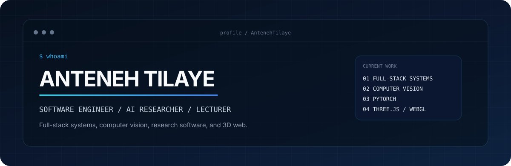
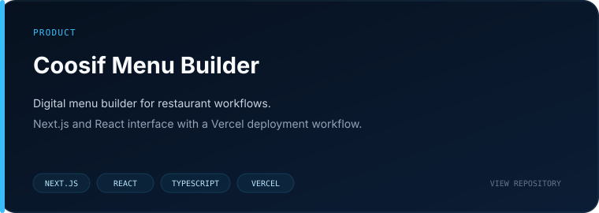
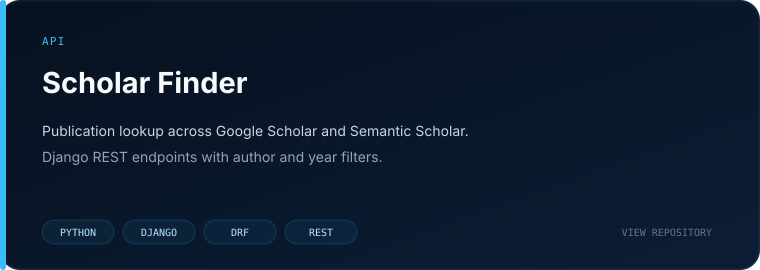
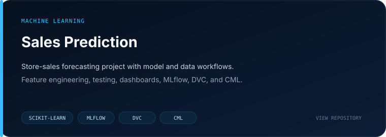
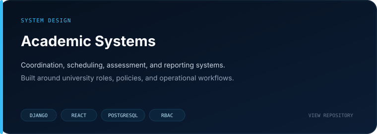
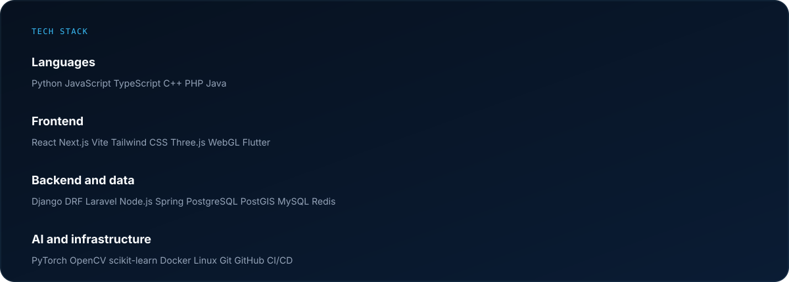
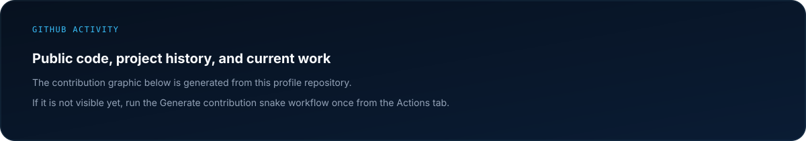

<div align="center">
  
</div>

<p align="center">
  <a href="https://antenehtilaye.github.io/"><strong>Portfolio</strong></a>
  &nbsp;&nbsp;/&nbsp;&nbsp;
  <a href="https://www.linkedin.com/in/anteneh-tilaye-bb6770149/"><strong>LinkedIn</strong></a>
  &nbsp;&nbsp;/&nbsp;&nbsp;
  <a href="mailto:antenehtilaye19@gmail.com"><strong>Email</strong></a>
</p>


## 01 / Profile

```text
name      : Anteneh Tilaye
role      : Software Engineer, Lecturer, AI/ML Researcher
location  : Ethiopia

work      : full-stack systems, APIs, academic platforms, research software
research  : computer vision, intelligent systems, mobile robot navigation
graphics  : Three.js, WebGL, realtime browser interfaces
current   : PyTorch internals, AI systems, software architecture
```

I am a software engineer and university lecturer with a background in software engineering, computer science, and applied AI.

My MSc research focused on object detection for mobile robot navigation in dynamic indoor environments. My software work includes full-stack systems, APIs, academic platforms, data products, computer vision, and realtime 3D browser interfaces.


## 02 / Selected work

<div align="center">
  <a href="https://github.com/AntenehTilaye/coosif-menu-builder"></a>
  <a href="https://github.com/AntenehTilaye/scholar-finder"></a>
  <br/>
  <a href="https://github.com/AntenehTilaye/Sales-Prediction-For-Pharmaceutical"></a>
  
</div>

<br/>

<table>
<tr>
<td width="50%" valign="top">

### Coosif Menu Builder

Digital menu product work built with Next.js, React, TypeScript, and Vercel.

`Next.js` `React` `TypeScript`

[Repository](https://github.com/AntenehTilaye/coosif-menu-builder)

</td>
<td width="50%" valign="top">

### Scholar Finder

Django REST API for retrieving author publications from Google Scholar and Semantic Scholar.

`Python` `Django` `DRF`

[Repository](https://github.com/AntenehTilaye/scholar-finder)

</td>
</tr>
<tr>
<td width="50%" valign="top">

### Sales Prediction

Store-sales forecasting project with feature engineering, model development, tests, dashboards, and MLOps tooling.

`scikit-learn` `MLflow` `DVC`

[Repository](https://github.com/AntenehTilaye/Sales-Prediction-For-Pharmaceutical)

</td>
<td width="50%" valign="top">

### Telecom User Analytics

Telecom analysis covering customer engagement, network experience, satisfaction, and usage patterns.

`Python` `Analytics` `Visualization`

[Repository](https://github.com/AntenehTilaye/User-Analytics-For-Telecom)

</td>
</tr>
<tr>
<td width="50%" valign="top">

### University Scheduling System

Interface work for university scheduling and academic planning.

`Scheduling` `Web`

[Repository](https://github.com/AntenehTilaye/uni-scheduling-system)

</td>
<td width="50%" valign="top">

### Countify

PHP MVC application with controllers, models, migrations, validation, and deployment support.

`PHP` `MVC` `MySQL`

[Repository](https://github.com/AntenehTilaye/Countify)

</td>
</tr>
</table>

<p align="center">
  <a href="https://github.com/AntenehTilaye?tab=repositories"><strong>Browse all repositories</strong></a>
</p>


## 03 / Professional and research work

The following work is private, organization-owned, deployed elsewhere, or not represented by a public repository.

<table>
<tr>
<td width="50%" valign="top">

### Coordio

Capstone coordination and evaluation system for university departments.

Covers project registration, advising, rubrics, submissions, examinations, grading, and reporting.

</td>
<td width="50%" valign="top">

### TuQualify

React and Django REST Framework application work, including technical leadership and production development.

</td>
</tr>
<tr>
<td width="50%" valign="top">

### 3D realtime systems

Three.js and WebGL development for realtime browser interfaces, including a betting-game interface similar to Keno.

</td>
<td width="50%" valign="top">

### Computer vision research

Object detection for mobile robot navigation in dynamic indoor environments.

</td>
</tr>
<tr>
<td width="50%" valign="top">

### WebRTC and mobile

Realtime communication and application development across web and mobile stacks.

</td>
<td width="50%" valign="top">

### GIS systems

Application and data workflows using PostGIS, spatial data, QGIS, and related GIS tooling.

</td>
</tr>
</table>


## 04 / Stack

<div align="center">
  
</div>


## 05 / Research interests

<table>
<tr>
<td width="33%" valign="top">

**Computer vision**

Object detection, visual perception, and applied vision systems.

</td>
<td width="33%" valign="top">

**Deep learning systems**

PyTorch internals, model execution, training systems, and performance.

</td>
<td width="33%" valign="top">

**Robotics**

Perception and software for autonomous and mobile systems.

</td>
</tr>
<tr>
<td width="33%" valign="top">

**Software architecture**

Backend design, APIs, data models, and maintainable application structure.

</td>
<td width="33%" valign="top">

**3D web**

Three.js, WebGL, realtime interfaces, and browser graphics.

</td>
<td width="33%" valign="top">

**Applied systems**

Academic, government, and operational information systems.

</td>
</tr>
</table>


## 06 / Teaching

I teach programming and software engineering and supervise student projects. Teaching keeps the fundamentals close to my day-to-day engineering work and has made clear technical explanation part of how I design and review software.


## 07 / GitHub activity

<div align="center">
  
</div>

<br/>

<picture>
  <source media="(prefers-color-scheme: dark)" srcset="https://raw.githubusercontent.com/AntenehTilaye/AntenehTilaye/output/github-contribution-grid-snake-dark.svg" />
  <source media="(prefers-color-scheme: light)" srcset="https://raw.githubusercontent.com/AntenehTilaye/AntenehTilaye/output/github-contribution-grid-snake.svg" />

</picture>


## 08 / Contact

<p>
For software engineering, research collaboration, AI/ML work, or technical project discussions:
</p>

<p align="center">
  <a href="mailto:antenehtilaye19@gmail.com"><strong>antenehtilaye19@gmail.com</strong></a>
  &nbsp;&nbsp;/&nbsp;&nbsp;
  <a href="https://www.linkedin.com/in/anteneh-tilaye-bb6770149/"><strong>LinkedIn</strong></a>
  &nbsp;&nbsp;/&nbsp;&nbsp;
  <a href="https://antenehtilaye.github.io/"><strong>Portfolio</strong></a>
</p>
